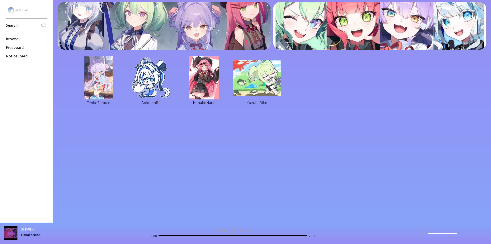
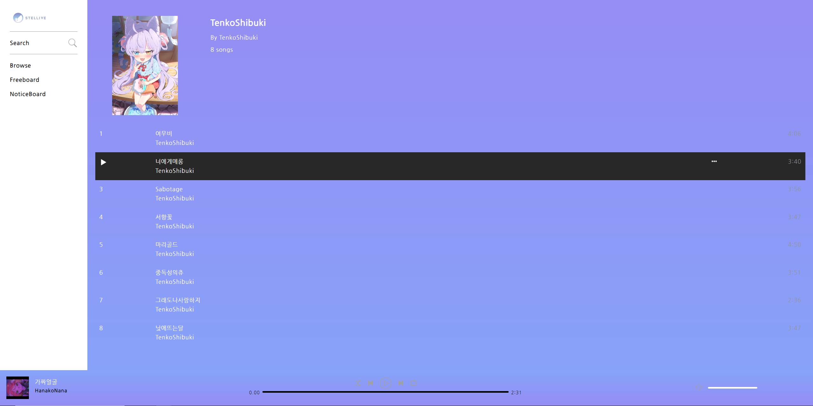
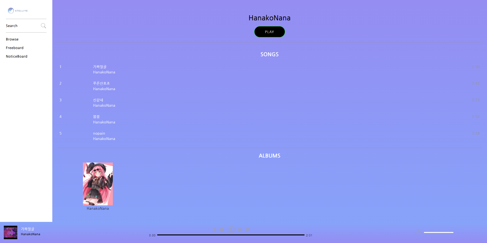
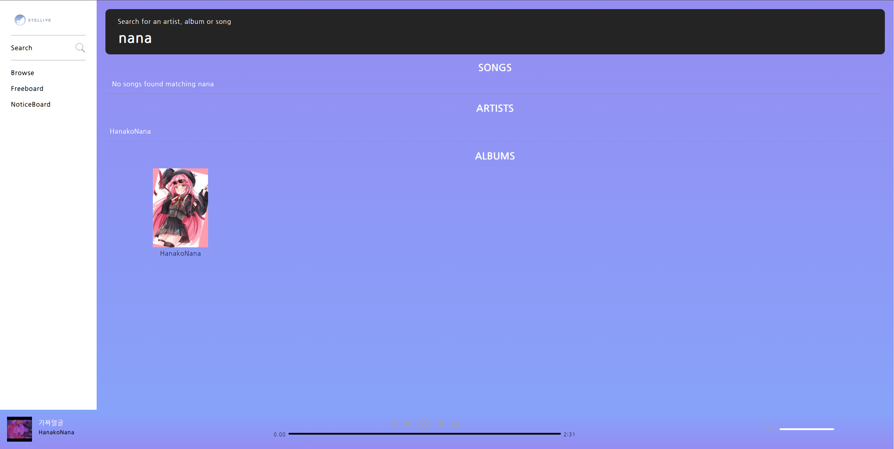
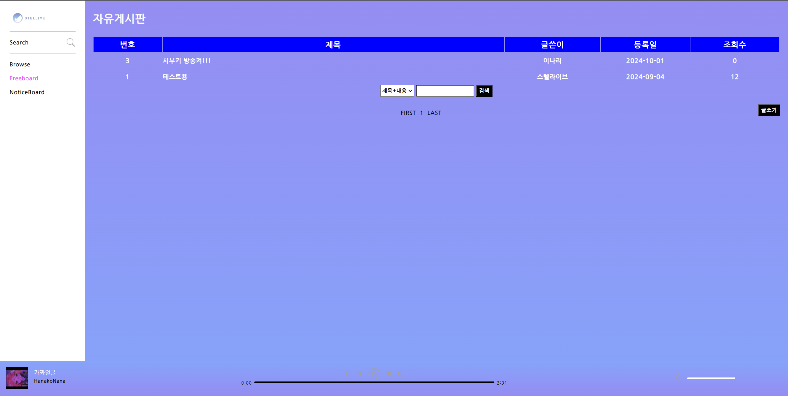

# Stellive Music Play Site
<!--프로젝트 메인 이미지-->

# 언어 사용량 통계

<!--목차-->
# 목차
- [Project](#project)
    - [Features](#features)
    - [Techniques](#techniques)
- [Page](#page)
    - [Main Page](#main-page)
    - [Playlist Page](#playlist-page)
    - [Artist Page](#artist-page)
    - [Search Page](#search-page)
    - [Board Page](#board-page)
- [Contact](#contact)

<!--프로젝트 설명-->
## Project
- 해당 프로젝트는 방송인 그룹 **Stellive**의 MusicPlaylist Site로 음악감상, 플레이리스트 확인 및 재생, 검색, 게시판 기능을 포함합니다.
- Music사이트의 구성 및 구현 방법 연습 및 게시판 작업 연습을 중점으로 둔 프로젝트입니다.

### Features
- 각 멤버별 Playlist를 구분하여 멤버별 노래를 들을 수 있습니다.
- 검색 기능을 통한 일부 단어로 검색이 가능합니다.
- 게시판 기능을 이용해 이용 유저들과 소통이 가능합니다.

### Techniques
- [PHP]
- [phpMyAdmin]
- [HTML5], [CSS3], [JavaScript]
- [Bootstrap]
- [Visual Studio Code]

<!--각 페이지 설명-->
## Page

### Main Page

- **Main Page**입니다. 해당 페이지는 Navigation에서 browse를 클릭하는 경우 나오는 페이지 입니다.
- 각 멤버별 Playlist를 보여주며 하단 PlayBar의 경우 랜덤한 노래 10개를 Playlist에 등록되어 재생됩니다.

### Playlist Page

- **Playlist Page**입니다. Main Page에서 멤버 Image를 클릭하는 경우 볼 수 있습니다.
- 멤버의 노래 리스트 확인 및 재생을 통해 Playlist의 내용을 수정할 수 있습니다.

### Artist Page

- **Artist Page**입니다. PlayBar에서 멤버의 이름을 클릭하는 경우 확인 할 수 있습니다.
- 해당 멤버의 모든 노래 재생 및 index의 상단 5개의 노래 확인, Album의 이미지 확인이 가능합니다.

### Search Page

- **Search Page**입니다.  Navigation의 Search를 클릭하여 확인할 수 있습니다.
- 노래 이름 및 가수, 앨범의 이름 일부 검색을 통해 원하는 정보를 얻을 수 있습니다.

### Board Page

- **Board Page**입니다.  Navigation의 FreeBoard와 NoticeBoard 클릭을 통해 확인 할 수 있습니다.
- **FreeBoard**의 경우 이용자들과 소통이 가능하며, **NoticeBoard**는 공지사항을 확인할 수 있습니다.
- 게시판 작성의 경우 Summernote의 기능을 이용하였으며, Bootstrap을 이용해 디자인하였습니다.

<!--접근-->
## Contact
- 📧  **wodnd565@gmail.com**
- 📞  **010 - 5657 - 4813**
